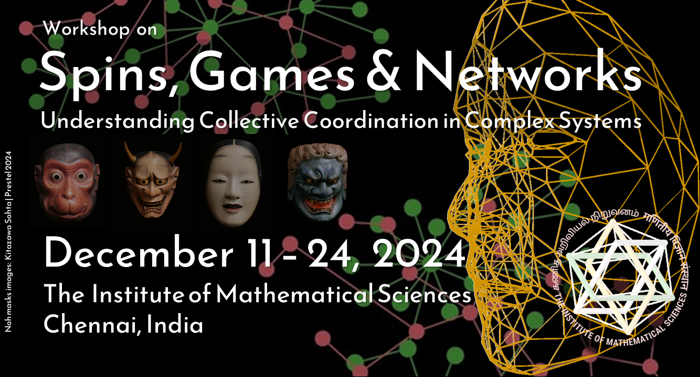
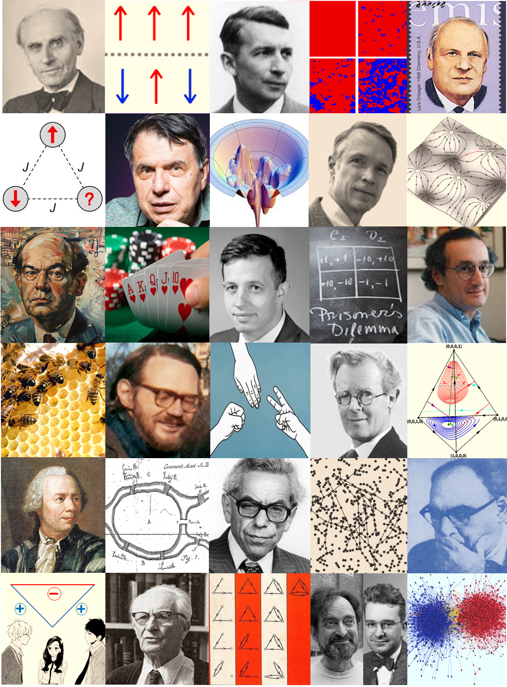
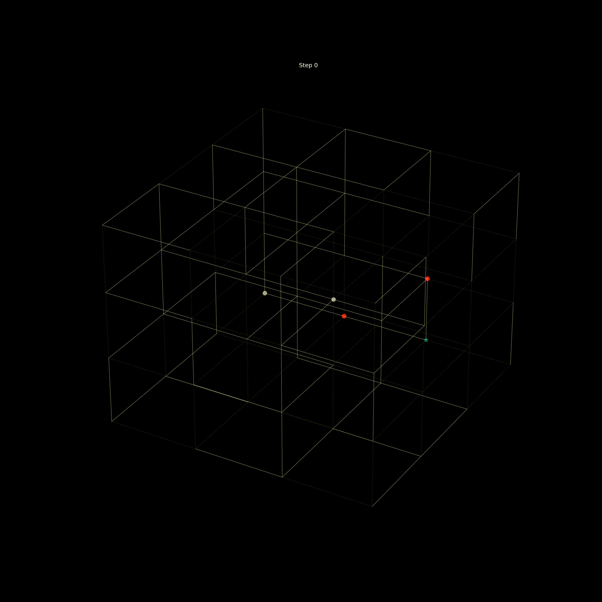
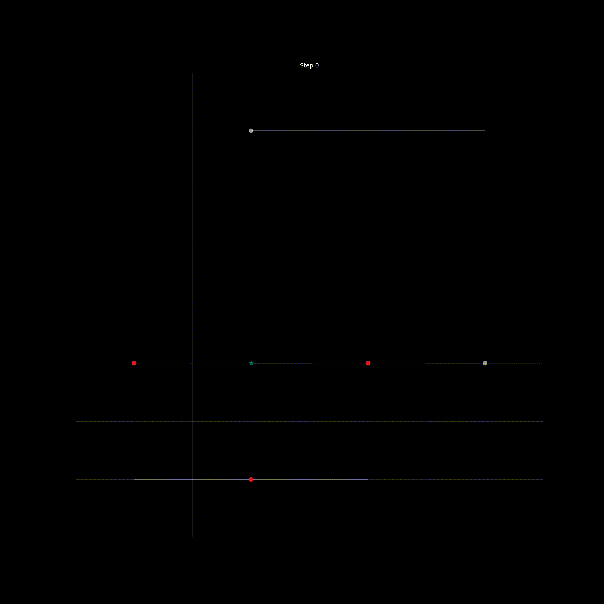

# 🚶‍♂️ Random Walker Simulations on Diluted N-Dimensional Lattices

<div align="center">


**A random walker simulation with varying steps and real-time visualization in 2D or 3D**

[🚀 Demo](#demo)  • [🚀 Quick Start](#quickstart) • [🤝 Contributing](#contributing)

</div>

---

<div align="center">

### 🏛️ SPINS, GAMES AND NETWORKS Workshop



*Part of SGN 2024 workshop series*

</div>


<div align="center">




</div>

### 🎯 Overview

This project simulates random walkers on diluted lattices with real-time visualization capabilities. Developed as part of **SPINS, GAMES AND NETWORKS** ([SGN 2024](https://www.imsc.res.in/~sitabhra/meetings/sgn24/)) workshop at The Institute of Mathematical Sciences (IMSc), Chennai.

## ✨ Features

- 🎯 **Real-time Animation** - responsive 2D-3D Walker visualization
- 🧠 **Multiple Walker Types** - Random walk with varying steps and step sizes  
- 🎨 **Customizable Dilution** - customize the probability of node connection in a Nd lattice
- 📊 **Data Export** - Save simulation results for analysis
- ⚡ **Performance** - large-scale simulations with room for optimization.


## 🎬 Demo

<div align="center">
  
  &nbsp;&nbsp;&nbsp;&nbsp;
  
</div>

*Real-time visualization of 5 of one step and 1 two step walkers performing random walks on dilted lattices*

</div>

## 🚀 Quick Start

```bash
# Clone the repository
git clone https://github.com/shalemrajkumar/hare_and_tortoise.git
cd hare_and_tortoise

# Install dependencies
pip install -r requirements.txt

# Run a basic simulation
python main.py
```


## 🤝 Contributing

We love contributions! Here's how to get started:

1. 🍴 Fork the repository
2. 🌿 Create a feature branch (`git checkout -b feature/amazing-feature`)
3. 💻 Make your changes
4. ✅ Add tests for new functionality
5. 📝 Commit your changes (`git commit -m 'Add amazing feature'`)
6. 🚀 Push to branch (`git push origin feature/amazing-feature`)
7. 🎉 Open a Pull Request


## 📄 License

This project is licensed under the MIT License - see the [LICENSE](LICENSE) file for details.

## 🙏 Acknowledgments

- Special thanks to our mentors Shakti N. Menon, Anuran Pal and Sitabhra Sinha.
- Thanks to team members Atul Prakash and Mahesh for their cool ideas.
- Built with ❤️ for the scientific Python community

## 📞 Contact & Support

- 🐛 **Bug Reports**: [GitHub Issues](https://github.com/shalemrajkumar/hare_and_tortoise/issues)
- 💬 **Questions**: [GitHub Discussions](https://github.com/shalemrajkumar/hare_and_tortoise/discussions)
- 📧 **Email**: shalemrajkumar7@gmail.com
- 🐦 **Twitter**: [@SHALEMRAJKUMAR](https://twitter.com/SHALEMRAJKUMAR)

---

<div align="center">

**⭐ Star this repo if you found it helpful! ⭐**

Made with 🔬 by [Shalem Rajkumar](https://github.com/shalemrajkumar)

</div>
